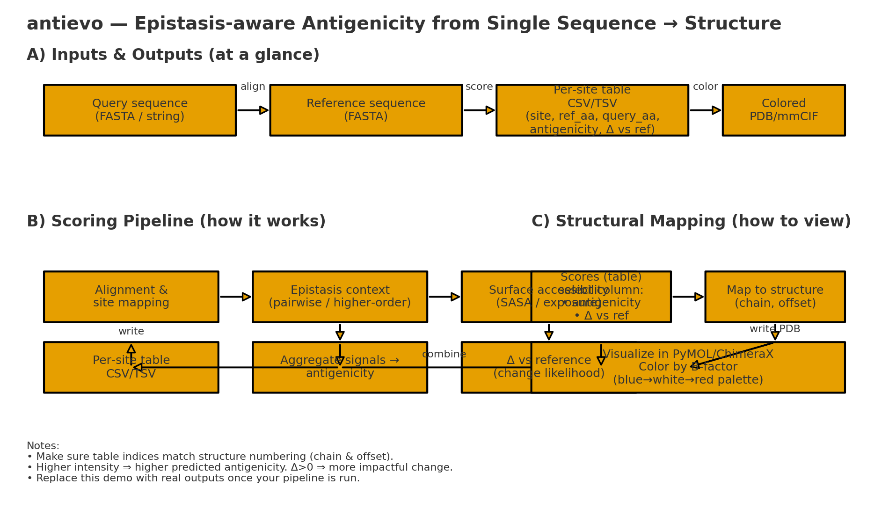

# antievo

> Predict epistasis‑aware antigenicity from a single protein sequence and map it onto 3D structure.

[](#requirements) [](./LICENSE)

---

## Overview (1 picture)

<p align="center">
  
</p>

**What it does**

* Takes **one query sequence** and a **reference**.
* Computes **per‑site antigenicity** (epistasis + accessibility).
* Outputs a **per‑site table** and a **colored PDB/mmCIF** for visualization.

---

## Quickstart

### 1) Setup

```bash
# conda
conda create -n antievo python=3.10 -y
conda activate antievo
# or venv
python -m venv .venv && source .venv/bin/activate
# deps (adjust if you have requirements.txt)
pip install numpy pandas biopython matplotlib
```

### 2) Sequence → Per‑site Table

```bash
python EpistaticSurfaceAccessibilityVirus_V4.py \
  --query path/to/query.fasta \
  --reference path/to/reference.fasta \
  --out results/ \
  --id SAMPLE1 \
  --format csv
```

### 3) Table → Colored Structure

```bash
python generate_colored_pdbs.py \
  --pdb path/to/structure.pdb \
  --scores results/SAMPLE1_sites.csv \
  --score-column antigenicity \
  --out results/structure/
```

**View**: open the output PDB in PyMOL/ChimeraX and color by **B‑factor**.

---

## Notes

* Make sure table residue indices match your PDB chain/numbering (use chain/offset if needed).
* If a flag name differs, run `--help` on the scripts and adjust.

---

## Requirements

* Python 3.10+
* Python libs: `numpy`, `pandas`, `biopython`, `matplotlib`

---

## License

MIT (see [LICENSE](./LICENSE)).

## Citation

*Add citation here if applicable.*
